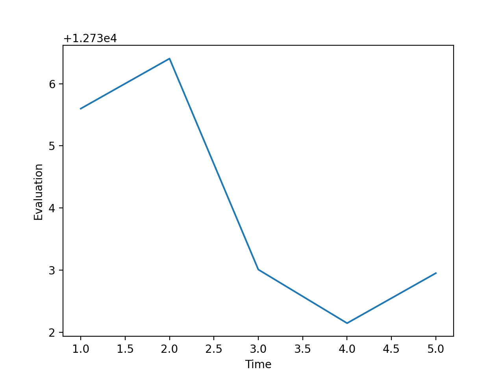

# Course Scheduling Using Constraint Satisfaction

- Our final project focusses on the problem of course scheduling. We wanted to devise a program that could be realistically deployed for use given certain data that should be readily available by a college or university. The program calls for a list of course data specifying the available rooms, qualified instructors, and desired time of day to schedule the course (i.e. morning, afternoon, evening). Optionally, the user can provide a list of additional soft constrains for the instructor's preferences for courses and times to be scheduled for.

## Contents

- [Implementation](#implementation)
- [Contributions](#contributions)
- [Visualization](#visualization)
- [Data](#data)

## Implementation

- **Backtracking Search**
    - Used for small datasets

- **Iterative Approach**
    - Used for large datasets
    - Selective randomness to domain values
    - Clusters consistent schedules and selects highest evaluation after many iterations

    

- **Random restarts**
    - Used to prevent getting stuck in local minimum

- **Hard Constraints**
    - Instructor time conflicts
    - Room time conflicts

- **Soft Constraints**
    - Instructor course/time preferences

## Contributions

### Team
- Both members contributed toward developing the scheduling algorithm and discussing implementation problems and ideas

### Jonathan Kelaty
- Built visualization tool
- Scraped and normalized Hunter College course data

### Manal Zneit
- Wrote program implementation
- Created test datasets

## Visualization
- Visualization tool built using React for frontend
- Backend API using Heroku to run scheduler
- Upload course data and visualize schedule
- Filter for constrained variables
- <a href="https://jkelaty.github.io/course-scheduling/" target="_blank">View visualization tool here</a>

    

## Data
- Course data was scrapped from CUNY course offerings (~2000 sections)
- Normalized times, rooms, and instructor assignments
- Successfully scheduled ~500 courses in < 20 seconds
